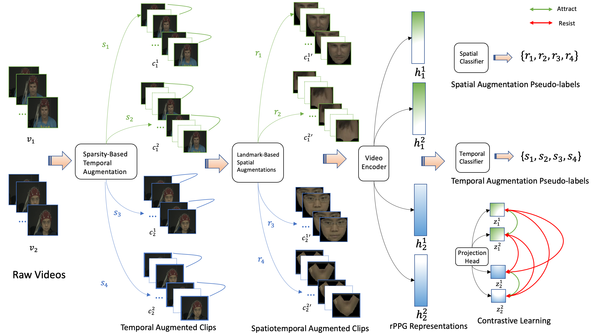

# SLF-RPM: Self-supervised Representation Learning Framework for Remote Physiological Measurement Using Spatiotemporal Augmentation Loss

This repository hosts the PyTorch implementation of SLF-RPM.

The paper is accepted by AAAI-22 and is available at: [Arxiv](https://arxiv.org/abs/2107.07695).



## Highlights

* **Simple and flexible training process**: SLF-RPM can be easily scaled to any RPM-related datasets and models acting as an effective pre-training strategy.

* **RPM-specific data augmentation**
  * *Landmark-based spatial augmentation*: Split and compare different facial parts to effectively capture the colour fluctuations on human skin.

  * *Sparsity-based temporal augmentation*: Characterise periodic colour variations using Nyquist–Shannon sampling theorem to exploit rPPG signal features.

* **More stable contrastive learning process**: A new loss function using the pseudo-labels derived from our augmentations to regulate the training process of contrastive learning and handles complicated noise.

* **Collections of benchmarks**: Several SOTA supervised and self-supervised studies are evaluated and compared.

## Dependencies and Installation

To install required packages, you can install packages with `pip` by

```bash
pip install -r requirements.txt
```

After preparing required environment, you can clone this repository to use SLF-RPM.

## Data

Please refer to the official websites for license and terms of usage.

We provide each dataset links below:

* *MAHNOB-HCI*: https://mahnob-db.eu/hci-tagging/view_collection/hr-estimation-v1.

* *UBFC-rPPG*: https://sites.google.com/view/ybenezeth/ubfcrppg.

* *VIPL-HR-V2*: https://sites.google.com/site/huhanhomepage/download.

## Usage

To train and test SLF-RPM, you can run:

```bash
chmod u+x ./run.sh
bash ./run.sh
```

*Note:* make sure you have setup `dataset_dir` path correctly.

We also provide a demo program for showcase. Currently, it only supports single video input. You can run:
```python
python demo.py -p /pretrained/model/path -i source.mov -o target.mov
```

## Identified Issues

1. If you meet `[W pthreadpool-cpp.cc:90] Warning: Leaking Caffe2 thread-pool after fork. (function pthreadpool)` in your machine, please check this [PyTorch issue](https://github.com/pytorch/pytorch/issues/57273).

## Models and Results

For your convinience, we provide trained model weights (before linear probing) and results on each dataset (after linear probing).

|   **Dataset**  | **Model** |  **MAE**  |  **RMSE** |   **SD**  |   **R**  |
|:----------:|:-----:|:-----:|:-----:|:-----:|:----:|
| MAHNOB-HCI |  [Download](https://github.com/Dylan-H-Wang/SLF-RPM/releases/download/v1.0/mahnob_best.pth)   |  3.60 |  4.67 |  4.58 | 0.92 |
|  UBFC-rPPG |  [Download](https://github.com/Dylan-H-Wang/SLF-RPM/releases/download/v1.0/ubfc_best.pth)     |  8.39 |  9.70 |  9.60 | 0.70 |
| VIPL-HR-V2 |  [Download](https://github.com/Dylan-H-Wang/SLF-RPM/releases/download/v1.0/vipl_best.pth)     | 12.56 | 16.59 | 16.60 | 0.32 |

## Citation

If you find this repo useful in your work or research, please cite:

```
@article{Wang2021SelfSupervisedLF,
  title={Self-Supervised Learning Framework for Remote Heart Rate Estimation Using Spatiotemporal Augmentation},
  author={Hao Wang and Euijoon Ahn and Jinman Kim},
  journal={ArXiv},
  year={2021},
  volume={abs/2107.07695}
}
```
